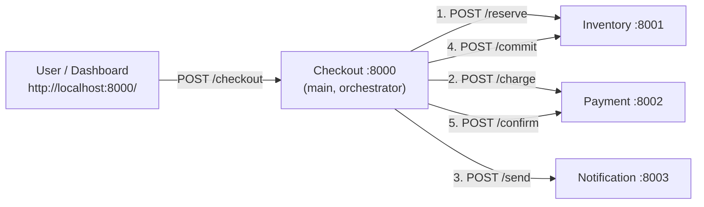

# Blast Radius Demo — Checkout System

A 4-service Python/FastAPI monorepo built to demonstrate the **blast radius**
of a bad deploy: when the upstream **Checkout** service ships broken code,
its three downstream dependencies (Inventory, Payment, Notification) end up
holding stuck reservations, orphaned charges, and missing notifications —
even though they themselves are perfectly healthy.

Built for a hackathon demo. Runs as plain local processes. Single-page
dashboard ships built-in.

---

## Architecture



The checkout flow is a 5-call orchestration. The "broken" build of Checkout
crashes between step 2 and step 3 — after the customer is charged and stock
is reserved, but before notification, commit, and confirm. None of the
compensating actions (release / refund) run either.

---

## Repo layout

```
blast-radius-demo/
├── requirements.txt
├── services/
│   ├── checkout/        main orchestrator + dashboard host (port 8000)
│   ├── inventory/       stock + reservations             (port 8001)
│   ├── payment/         charges ledger                   (port 8002)
│   └── notification/    sent log                         (port 8003)
├── dashboard/           static HTML/CSS/JS, served by checkout
└── scripts/             start_all / stop_all / deploy_good / deploy_bad
```

---

## Setup

Requires Python 3.9+.

```bash
python3 -m venv .venv
source .venv/bin/activate
pip install -r requirements.txt
```

The start script auto-detects `.venv/bin/python` if it exists, otherwise
falls back to whatever `python3` is on `PATH`.

---

## Run

```bash
./scripts/start_all.sh
```

Then open **http://localhost:8000/** in a browser.

To stop everything:

```bash
./scripts/stop_all.sh
```

Logs live in `logs/<service>.log`, pidfiles in `logs/<service>.pid`.

---

## Demo script (5 minutes)

1. **Run** `./scripts/start_all.sh` and open `http://localhost:8000/`.
   All 4 service cards should be green. Checkout is highlighted as `main`.

2. **Place a few healthy orders.** Click **Place test order** 2–3 times.
   - Every step lights green: reserve → charge → notify → commit → confirm.
   - Inventory stock decreases, payments are confirmed, notifications sent.

3. **Deploy the bad build.** Click **Deploy v1.0.1 (broken)**.
   The Checkout card briefly goes red (restarting), then comes back amber
   with `Build mode: BROKEN (v1.0.1)`. Checkout is alive — `/health`
   returns 200 — but it has a latent bug.

4. **Try to check out.** Click **Place 5 orders**. All return HTTP 500 to
   the user. But look at the downstream cards:
   - **Inventory**: stuck reservations climb. Real stock is gone.
   - **Payment**: orphaned charges climb. Customers are out money.
   - **Notification**: still healthy — but the missed-notifications
     counter keeps increasing because nobody told the customer.
   - The red **Blast radius detected** banner lights up at the top.

5. **Roll back.** Click **Deploy v1.0.0 (good)**. Checkout goes green
   again. New orders succeed. But the orphaned charges and stuck
   reservations from step 4 **stay there** — that's the lasting damage.
   Talking point: *the deploy is "fixed" but the blast hasn't been
   cleaned up. Someone has to write a reconciliation job.*

6. **Click Reset state** to clear all in-memory state across services
   and run the demo again.

---

## How "the broken build" actually breaks

In `services/checkout/main.py`:

```python
if BROKEN:
    record["steps"]["notify"] = "skipped"
    record["steps"]["commit"] = "skipped"
    record["steps"]["confirm"] = "skipped"
    record["status"] = "blast_radius"
    record["error"] = (
        f"checkout v{SERVICE_VERSION} crashed after charge: "
        "NullPointerException in OrderConfirmationHandler.send()"
    )
    raise HTTPException(status_code=500, detail=record["error"])
```

It runs after `/reserve` and `/charge` have already succeeded, and it
raises before `/send`, `/commit`, `/confirm`, **or** any compensating
`/release` / `/refund` call. That's the real-world signature of a bad
deploy: the new code passes its health check but corrupts state when it
hits actual traffic.

---

## API summary

Every service exposes:

- `GET /health` &mdash; liveness + version
- `GET /state` &mdash; in-memory state for the dashboard
- `POST /admin/reset` &mdash; clears in-memory state

**Checkout** (`:8000`)

- `POST /checkout` &nbsp; body `{customer, cart:[{sku,qty}], amount}`
- `POST /admin/deploy` &nbsp; body `{version: "good" | "bad"}` &mdash; restarts checkout in the requested build by shelling out to `scripts/deploy_*.sh`

**Inventory** (`:8001`)

- `POST /reserve` `{order_id, items}`
- `POST /commit`  `{order_id}`
- `POST /release` `{order_id}`

**Payment** (`:8002`)

- `POST /charge`  `{order_id, customer, amount}`
- `POST /confirm` `{order_id}`
- `POST /refund`  `{order_id}`

**Notification** (`:8003`)

- `POST /send` `{order_id, customer, type}`

---

## Environment variables

The Checkout service reads these at startup. The deploy scripts set them.

| Var | Default | Purpose |
| --- | --- | --- |
| `SERVICE_VERSION` | `1.0.0` | Reported in `/health` and stamped on each order |
| `BROKEN` | `0` | When `1`, crashes mid-checkout (the bad build) |
| `INVENTORY_URL` | `http://localhost:8001` | Inventory service base URL |
| `PAYMENT_URL` | `http://localhost:8002` | Payment service base URL |
| `NOTIFICATION_URL` | `http://localhost:8003` | Notification service base URL |

---

## Out of scope

In-memory state, no DB. No retries, no circuit breaker, no auth, no
Docker. Everything is intentionally simple so the blast-radius story
reads in one screen.
